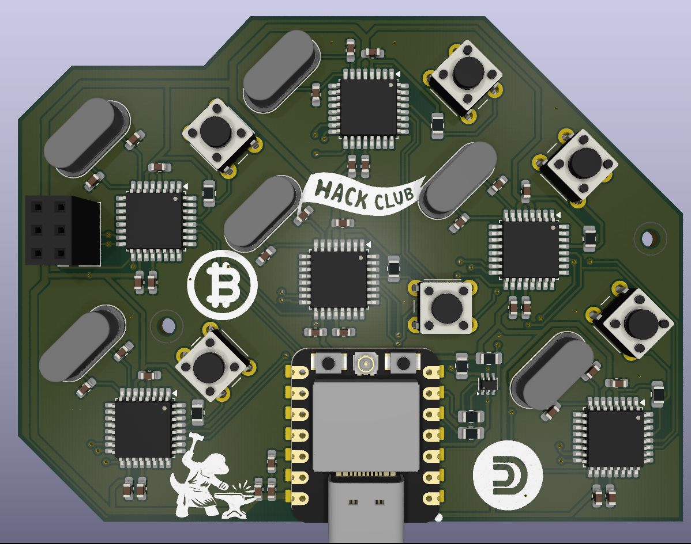
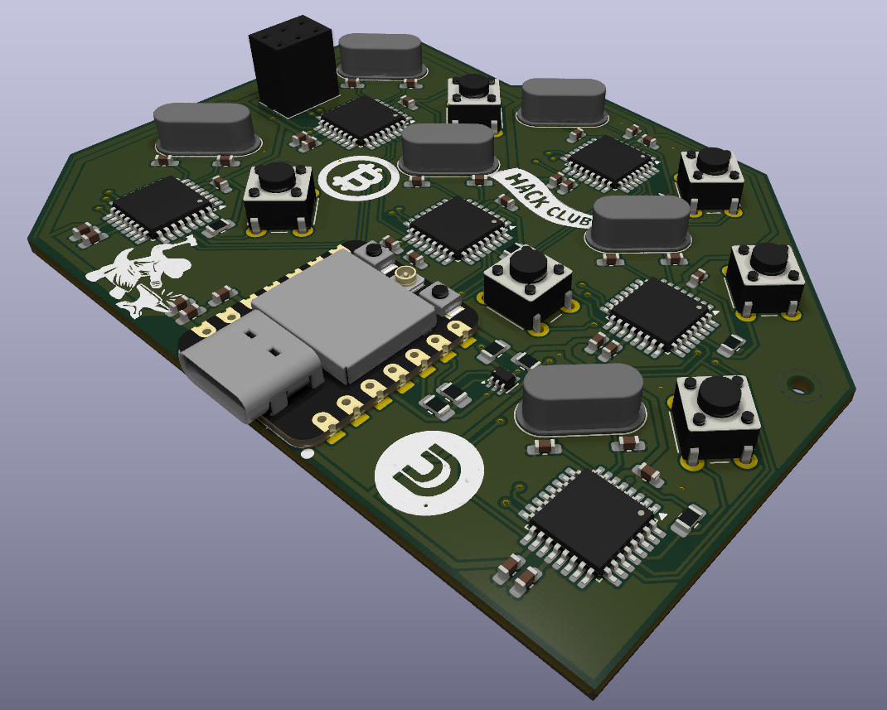
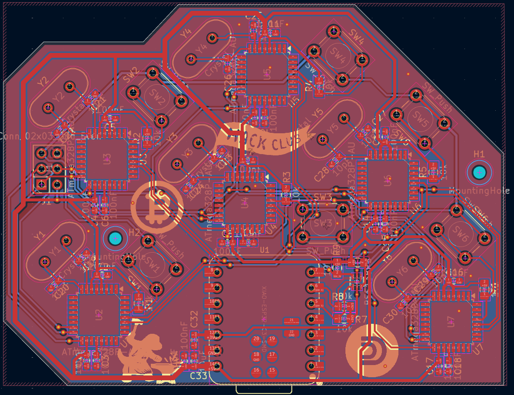
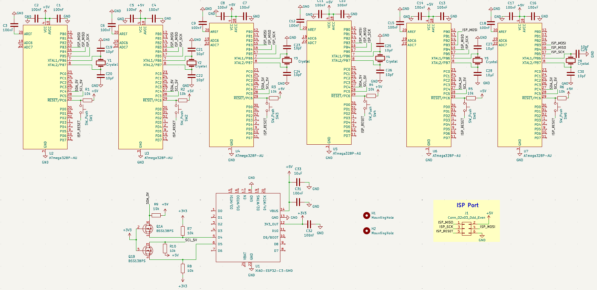
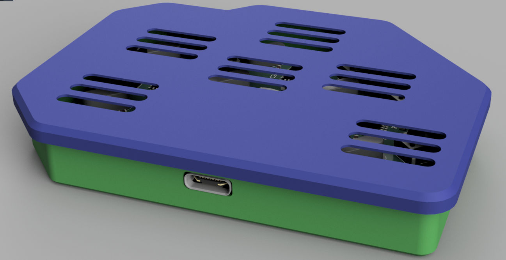
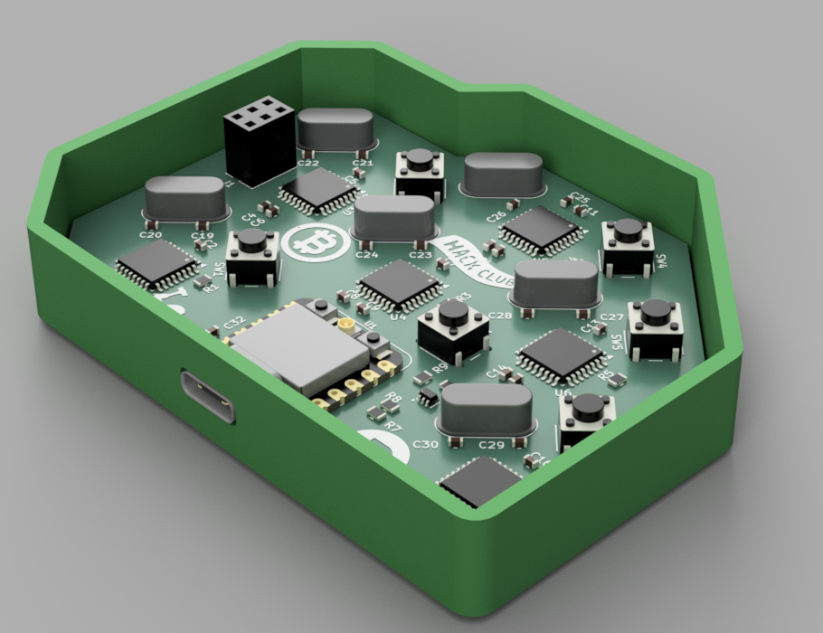
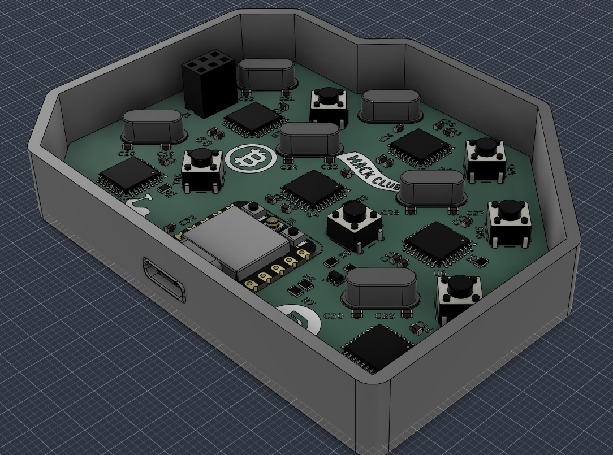
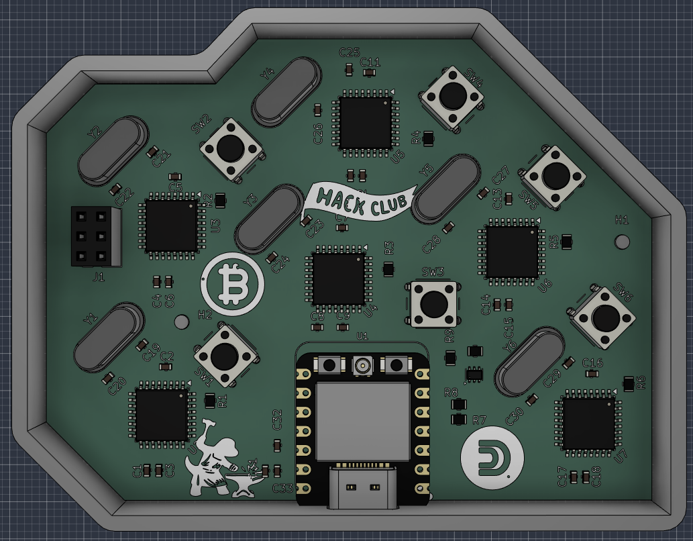
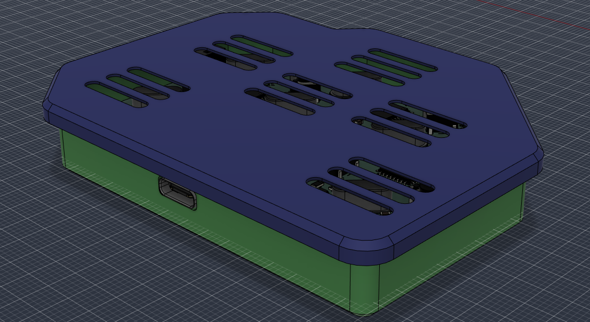

# DuinoCoinMiner

- **What is it?** It is a small PCB board with XIAO ESP32-C3 as main MCU for controlling 6 ATmega328P chips
- **What does it do?** It mines crypto currency called Duino Coin. Which is a specialized coin that can be mined on any device like arduinos and lot more. You read about it on their [site](duinocoin.com)

## Project Gallery

### 3D PCB Renders

  
  

### PCB Schematic and layout

  
  

### 3D Enclosure (Fusion 360)

*3D printable case made in Fusion 360. All CAD and 3D model files (`.f3z`, `.step`) are in the [`CAD/`](CAD/) folder.*

  
  

  
  

  

---

### Required Tools & Materials

- Soldering iron
- Good solder wire
- Solder flux 
- small tweezers for picking small components like resistors and condenzators 
- 3D Printer for printing case from /cad folder

### Assembly Steps

1. **Start with the chips:**
   
   - **ATmega328P-AU** and **BSS138PS** .
   - It is best to solder these first while the board is clear of other bigger things.

2. **SMD Components:**
- - C1–C18, C31, C32 
  - C19–C30 
  - C33
  - R1–R10
3. **Main MCU:**
-     **Seeed Studio XIAO ESP32-C3**.
  - Solder the XIAO directly onto the PCB pads or solder pin headers so you can plug it in(not recommended)
4. **THT Components:**
-     **Crystals:** 20MHz crystals. Clip the leads, and solder from the bottom side.
  - **Switches:** 6x6mm reset buttons. Snap them into their holes and solder.
  - **ISP pin Header:** 2x3 pin header. Solder it to the board.
5. **Enclosure Assembly:**
-     3D print the bottom base (`case.step`) and the lid (`case_lid.step`). Files are in the /CAD folder.
  - Place PCB inside the bottom enclosure, with XIAO USB-C port aligned to the hole, and attach the lid.

---

## Firmware

Firmware files are located in "firmware" folder with README.md that contains guide how to flash the chips correclty and what you will need to install.

## BOM

| Reference               | amount | Value / Component          | Footprint / Package      | Link                                                                                                    | Cost (USD) |
| ----------------------- |:------:|:-------------------------- |:------------------------ |:------------------------------------------------------------------------------------------------------- |:----------:|
| **C1-C18, C31 and C32** | 20     | 100nF 50V                  | 0603 SMD                 | [TME Link](https://www.tme.eu/cz/details/0603b104k500ct/kondenzatory-mlcc-smd/walsin/)                  | $0.40      |
| **C19-C30**             | 12     | 22pF 50V                   | 0603 SMD                 | [TME Link](https://www.tme.eu/cz/details/cc0603jrnpo9bn220/kondenzatory-mlcc-smd/yageo/)                | $0.36      |
| **C33**                 | 1      | 10µF 10V                   | 0603 SMD                 | [TME Link](https://www.tme.eu/cz/details/lmk107bj106maltd/kondenzatory-mlcc-smd/taiyo-yuden/)           | $0.12      |
| **J1**                  | 1      | 2x3 Pin Header             | Pin header 2x03 (2.54mm) | [TME Link](https://www.tme.eu/cz/details/bl2-06g/dutinkove-listy/connfly/)                              | $0.35      |
| **Q1**                  | 1      | BSS138PS mosfet            | SOT-363                  | [TME Link](https://www.tme.eu/cz/details/bss138ps.115/tranzistory-s-polem-n-kanalove-smd/nexperia/)     | $0.45      |
| **R1-R10**              | 10     | 10kΩ                       | 0805 SMD                 | [TME Link](https://www.tme.eu/cz/details/crcw080510k0fkea/rezistory-smd/vishay/)                        | $0.14      |
| **SW1–SW6**             | 6      | Switch (6x6mm, Height=5mm) | SW_PUSH_6mm_H5mm THT     | [TME Link](https://www.tme.eu/cz/details/1825910-6/mikroprepninace-tact-tht/te-connectivity/)           | $0.90      |
| **U1**                  | 1      | Seeed Studio XIAO ESP32-C3 | XIAO DIP/SMD Module      | [TME Link](https://www.tme.eu/cz/details/seeed-113991054/vyvojove-kity-ostatni/seeed-studio/113991054/) | $6.36      |
| **U2-U7**               | 6      | ATmega328P-AU (**20mHz**)  | TQFP-32                  | [TME Link](https://www.tme.eu/cz/details/atmega328p-au/mikrokontrolery-avr/microchip-technology/)       | $14.70     |
| **Y1-Y6**               | 6      | 20MHz Quartz Crystal       | HC-49/U THT              | [TME Link](https://www.tme.eu/cz/details/49-20.000maaj-b/krystalove-rezonatory-tht/qst/)                | $1.80      |
| **PCB**                 | 1      | 2 Layers                   |                          | [JLCPCB](https://jlcpcb.com)                                                                            | ±$14       |
| **Shipping**            |        | Total Shipping             |                          | TME and JLCPCB                                                                                          | $12.9      |
| **Total**               |        |                            |                          |                                                                                                         | **52.48**  |

JLCPCB cart:

